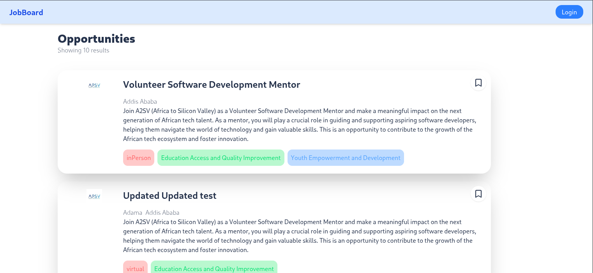
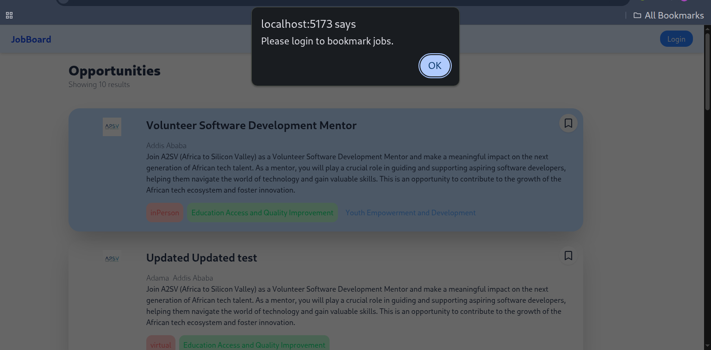
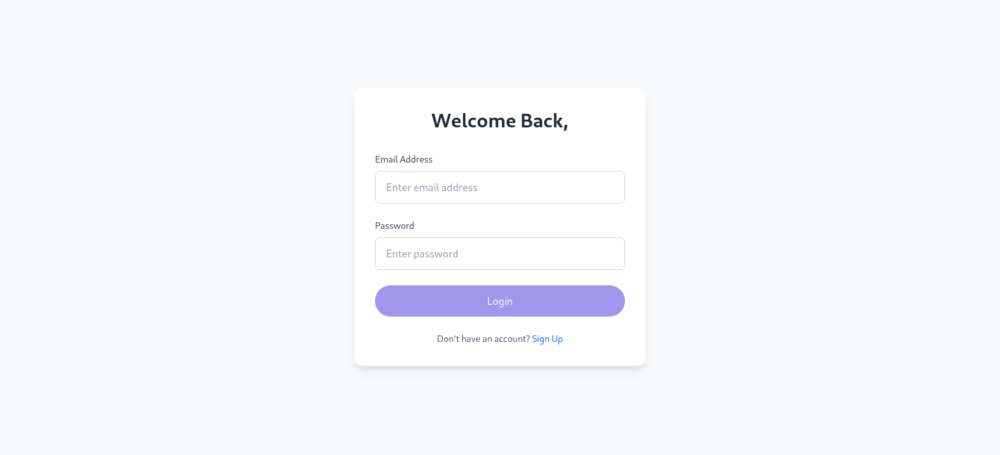
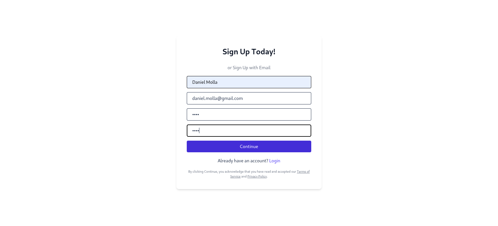
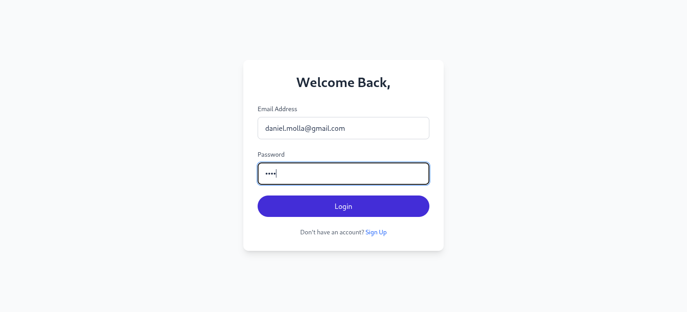
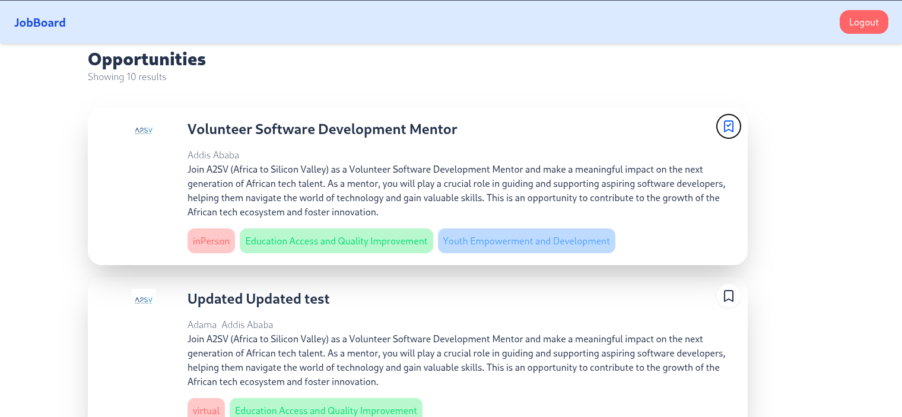
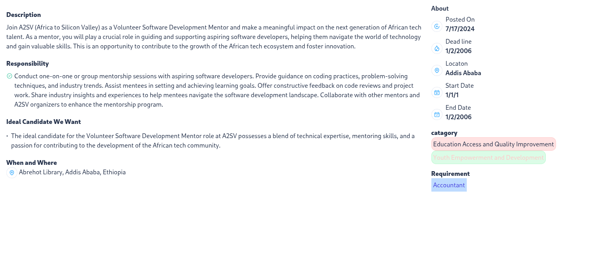
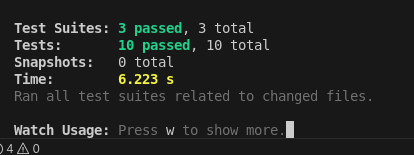
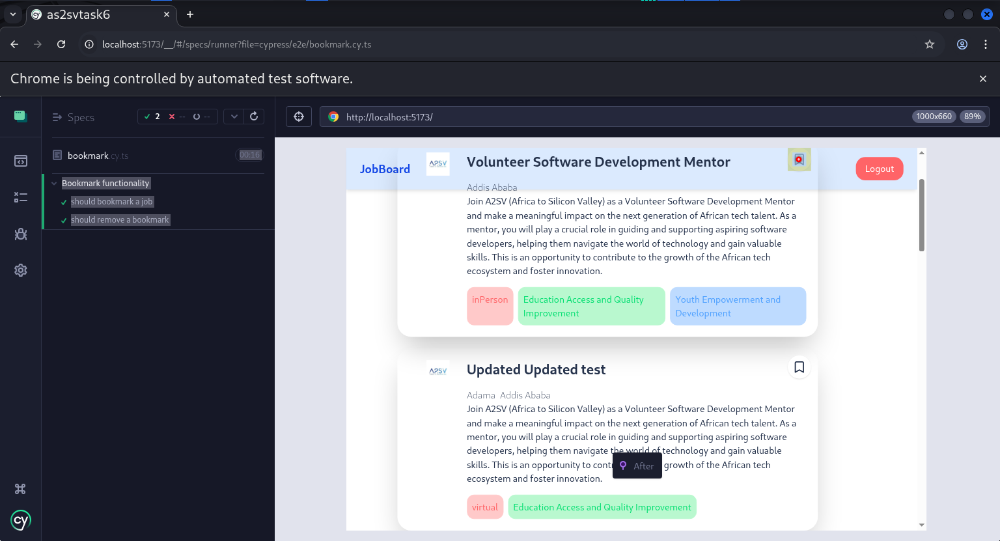

# Job Opportunities Listing App

A responsive **job listing application** built with **React, TypeScript, and Tailwind CSS** that allows users to browse job opportunities, view detailed descriptions, and manage bookmarks. This project integrates the **A2SV API** to fetch job data dynamically and provides **bookmark functionality for authenticated users**.

## 🚀 Features

- **Job Details**: View comprehensive job descriptions, responsibilities, and timelines.
- **Requirements & Skills**: See technical skills, experience, and role-specific requirements.
- **Bookmark Jobs**: Authenticated users can bookmark their favorite job postings and manage them easily.
- **Responsive Design**: Fully mobile-friendly with Tailwind CSS utility classes.
- **Type Safety**: Built with TypeScript to reduce runtime errors and enhance developer experience.
- **Real API Integration**: Fetches live job data using the [A2SV API](https://akil-backend.onrender.com/) for up-to-date opportunities.

## ⚙️ How It Works

1. **Browse Jobs**: All job opportunities are fetched dynamically from the A2SV API.
2. **Login / Authentication**: Users must log in to access bookmark functionality. JWT tokens are stored in `localStorage`.
3. **Bookmark Jobs**: Click the bookmark icon to add/remove jobs from your bookmarked list. The UI updates instantly using React state and Redux Toolkit Query for API calls.
4. **View Job Details**: Click on a job card to see detailed descriptions, skills required, and other relevant information.

## 📸 Screenshots

### 🔍 Full Page View











## 🛠️ How to Run Locally

Ensure you have **Node.js** and **npm** installed.

```bash
# Clone the repository
git clone https://github.com/danipy2/as2svtask6.git
cd as2svtask6

# Install dependencies
npm install

# Start development server
npm run dev
```

Then open [http://localhost:5173](http://localhost:5173) in your browser.

> 🔑 Note: Bookmark functionality requires a **logged-in user**. Use the login page to authenticate before bookmarking jobs.

## 🏗️ Technologies Used

- **React** (UI Library)
- **TypeScript** (Type Safety)
- **Vite** (Fast Development Server)
- **Tailwind CSS** (Styling & Responsive Design)
- **React Router** (Navigation)
- **Redux Toolkit Query** (Data Fetching & State Management)
- **Lucide-React** (Icons for bookmarks)

## 📦 API Integration

- Job data is fetched from the **A2SV API** (`/opportunities/search`)
- Bookmark actions (`add` / `remove`) interact with API endpoints for **authenticated users**
- Uses JWT tokens stored in **localStorage** for authentication
